<!--
  Nothing here loads from a third-party server: every graphic is generated and
  committed by this repository itself.
    portrait.svg                  scripts/make_portrait.py      (one-off, from your photo)
    stats/streak/langs/year .svg  .github/workflows/refresh.yml (daily, GitHub GraphQL API)
  Palette: #0077B5 accent on light, #38BDF8 accent on dark, #E2E8F0 dark-mode text.
-->

## 🌐 Socials:

# 💻 Tech Stack:

                           

# 📊 GitHub Stats:

## ✍️ Dev Quote

> "Talk is cheap. Show me the code."
>
> — *Linus Torvalds*

